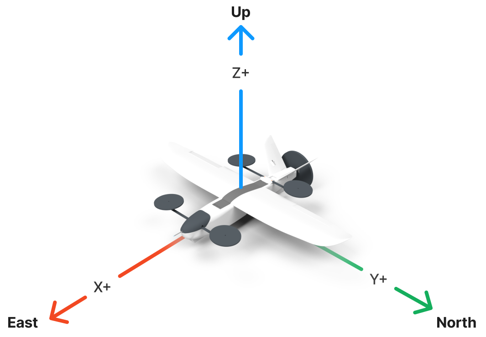

# Quadcopter / Quadplane Simulation

## Simulation Coordinate System

This simulation uses a local geodetic world frame and the ["default" Metor coordinate systems](https://docs.metor.systems/reference/coords/) for both the body frame and the world frame:
- In body frame, (+X, +Y, +Z) axes correspond to (forward, left, up) respectively
- In world frame, (+X, +Y, +Z) axes correspond to (East, North, Up) respectively



## Run simulation

```
metor editor main.py
```

## Run INDI analysis notebook

```
uv run ipython kernel install --user --name=drone
uvx --from jupyter-core --with jupyter jupyter lab --notebook-dir=analysis/
```

## Estimate INDI gains

1. First the run the simulation with cascaded PID control and write relevant telemetry data (gyro, motor RPMs) to a CSV file.

```
./main.py --telemetry
```

2. Run the `estimate_indi_gains.py` script to estimate the INDI gains.

```
./analysis/estimate_indi_gains.py
```
