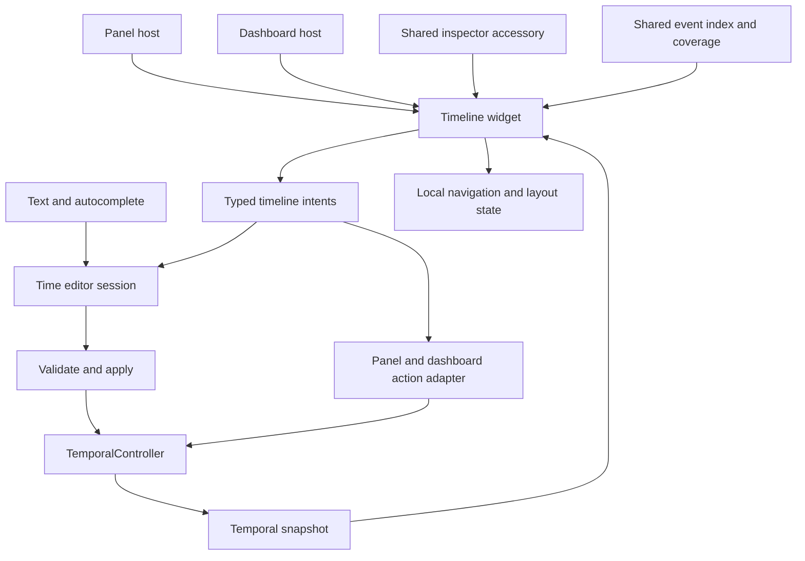

# Reusable timeline widget

Status: initial implementation available, 2026-09-05. Interaction and visual refinement in progress; runtime performance budgets below remain unmeasured.

## Implementation notes

The shared widget is available as a panel, dashboard widget, and time-editor accessory, including the 31 px floating inspector preview. Local fit/manual/follow navigation, range handles, scrubbing, overview navigation, event inspection, and shared inspector commands are implemented. Valid edits to view time and range endpoints now apply globally while typing or dragging. Timeline drags publish at most once per frame; incomplete or invalid text keeps the last valid value. Enter finishes and Escape/closing retains applied edits. The overview edits in place without changing inspector pages. Local plot overrides retain explicit application.

Event flags and readout cards now share the time-series renderer. Rounded tinted chips expose their whole painted label as a hover/click target, dense bursts show counts, and span bodies are interactive. Expanded lanes use a fixed source column, the application's table typography and minimum row height, separators, themed surfaces, and subtle rounding. Thin previews retain compact event marks with readouts outside their bounds. The current-time playhead is hidden in live mode, in both timelines and plots, and returns for paused/replay time. The live/data background fills the time area vertically. Range grabbers extend into the ruler with matching hit targets. Snapping a range endpoint to the data/live head retains a Live anchor; snapping a whole interval to that head creates a floating window of the same duration. Alt bypasses snapping.

Ordinary wheel and horizontal trackpad gestures zoom the time axis around the pointer, using the plot’s direction and sensitivity. Ctrl-scroll pans through time. Shift-scroll changes lanes only when they overflow, clamps at the last full page, and shows a small overflow indicator. A timestamp readout appears immediately while hovering; flag details replace it over events. Right-click, dragging, and leaving the timeline clear the readout. Hover does not replace the ruler.

The initial shared event index covers retained in-memory source history and reuses unchanged records across source generations. It does not fetch archived history or infer continuous coverage from the data extent. Generation changes still rebuild sorted indexes; cursor movement does not. Native pinch is unavailable in the current GPUI version; ordinary scrolling is the supported zoom gesture. Expanded lanes currently share spare height up to a cap, rather than packing multiple tiers of overlapping labels. Manual interaction review and measured performance checks remain outstanding; the acceptance criteria below describe the intended complete experience.

## Recommendation

Build one timeline widget with a ruler, draggable playhead, range brace, event lanes, and a small overview, including a genuinely usable thin mode around 31 logical pixels high. Host the same entity in a panel, a dashboard widget, and a preview beside the existing time editor's text and autocomplete. In the right-click inspector, the preview floats beneath the menu as a separate visual surface owned by that menu. Keep the global view time, global range, and each timeline's navigation viewport independent.

The default navigation mode is **Fit context**: show the recording, selected range, and view time, with room for advancing time. Zooming or panning enters **Manual** navigation. An explicit **Follow view time** mode keeps a fixed zoom while following playback. Double-clicking empty ruler space returns to Fit context. None of these navigation operations changes the global range or other plots' zoom.

Treat “cursor moves” as two cases: the advancing playback/live cursor, and a pointer actively dragging the playhead or a range handle. Ordinary hover only shows a timestamp. Automatically moving the viewport on hover would make targets difficult to acquire.

This plan extends [global time and replay](global-time-replay.md). It preserves text-first editing, anchored expressions, the existing icon source, millisecond display, and independent plot zoom.

## Prior art and what to adopt

The following are documented product behaviors. The telemetry-specific choices in the following sections are design proposals, including the growing Fit context algorithm; they are not claims that an editor implements that algorithm.

| Product and primary source | Relevant behavior | Application here |
| --- | --- | --- |
| [Ableton Live: Arrangement View](https://www.ableton.com/en/manual/arrangement-view/) | A separate overview supports navigation; a loop brace has independently draggable ends and a body that preserves duration. Follow is a separate control, and tracks can expand vertically. Selection zoom can be reversed. | Separate scrub, range, and overview surfaces. Use a brace for the range and make additional height expose lanes and labels. Provide Fit selection and Previous zoom commands. |
| [Logic Pro: Catch modes](https://support.apple.com/guide/logicpro/control-windows-using-catch-modes-lgcp5cbf1727/mac) | Following the playhead is optional. With Scroll in Play enabled, content scrolls beneath a centered playhead. | Give every timeline an explicit follow mode; manual exploration suspends following locally. |
| [Logic Pro: marker navigation](https://support.apple.com/en-ca/guide/logicpro/lgcpa855b268/mac) | Commands navigate to markers and use markers to establish a cycle range. | Events become navigation targets with shared “Go to event” and range commands. |
| [Premiere: Timeline preferences](https://helpx.adobe.com/premiere/desktop/get-started/preferences-and-settings/timeline-preferences.html) | Page scrolling and smooth scrolling are distinct playback behaviors; playhead snapping is configurable. | Prefer smooth following over discrete viewport jumps, and make snapping visible and optional. |
| [Final Cut Pro: timeline zoom](https://support.apple.com/en-ie/guide/final-cut-pro/ver4e2edcc/mac) and [clip appearance](https://support.apple.com/en-gb/guide/final-cut-pro/verb8e5d346/mac) | Commands fit timeline content horizontally or vertically; clip height and displayed detail can be adjusted. | Fit time and fit lanes are different operations. Use added height for information rather than uniformly stretching every row. |
| [Ardour: editor navigation](https://manual.ardour.org/editing/navigating-the-editor/) and [View menu](https://manual.ardour.org/ardours-interface/main-menu/View-menu/) | Navigation has a summary view, several zoom mechanisms, explicit zoom focus, and restoration of the previous zoom state. | Pointer zoom preserves time beneath the pointer; keyboard zoom uses the view time or viewport center. Keep local navigation history. |

Borrow navigation and selection concepts, not media editing semantics: telemetry events do not move when dragged, a selected range does not imply looping, and seeking does not automatically start playback. Clip trimming, ripple editing, musical quantization, and editing source telemetry are outside this feature.

## Existing code and integration constraints

| Current code | Design consequence |
| --- | --- |
| `src/temporal/{mod,model,picker,display}.rs` owns `TemporalController`, `TimeAction`, anchored expressions, time formatting, and shared inspector rows. | All global mutations go through that controller. Extend its existing picker session instead of adding a second parser or transport. |
| `src/views/dashboard/widgets.rs` has `WidgetSpec::with_tile`, used by `exec_timeline`. | Register one `TimelineConfig` and builder with kind/key `timeline`; both panel and dashboard consume that registration. Keep `exec_timeline` as a separate kind. |
| `src/inspector/mod.rs` has `Rows` and `View` pages; rows use a fixed-height `uniform_list`. `PreviewSpec` embeds a standalone view. | A timeline inside a tall row would break list measurement and compete with row activation. Add an optional, persistent accessory view outside the row list, keeping the query field and suggestions present. |
| `src/plot_events/mod.rs` has `EventSourceRegistry`, `EventKindKey`, `PlotEvent`, typed details, and generation tracking. | Reuse the sources and details. Add a bounded summary/index path for timelines, not another ingestion subsystem. |
| `EventSource::events_in` keeps only the newest 500 matching events. Logs/messages retain at most 20,000 records; alarms/sequences retain 1,000. | The current flag API cannot describe a whole-history distribution. Summarize all retained records and explicitly describe retention/unknown history. Archive retrieval is a separate adapter. |
| `PlotEvent` uses payload time for logs and record time for other sources. | Carry time-basis metadata and source filters. Do not silently imply that arrival timestamps align with a simulated telemetry clock. |
| `src/views/time_series/event_flags.rs` already clusters flags and draws compact chips. | Extract useful chip/text geometry and detail presentation into `plot_events` as needed; leave plot-specific rendering in place. |
| `src/views/exec_timeline/mod.rs` now coalesces requests into one scan worker. | Preserve that fix. The new widget must not instantiate an execution timeline or rescan telemetry history on every cursor tick. |
| Manual annotations and state lanes have separate documents under `docs/plans/viz/`; those documents describe proposed work. | Do not assume those stores or lanes exist. Provide a point/span rendering seam now; annotation authoring and state reconstruction can integrate later. |

## State and ownership

Use the following distinct concepts throughout the API and UI:

| Concept | Owner | Changes when |
| --- | --- | --- |
| Data extent and coverage | Existing temporal/source services | Data or metadata arrives; these are observed facts. |
| View time | `TemporalController` | Seek, live following, or replay advances. |
| Selected range | `TemporalController`, as `TimeRangeSpec` | A range command or completed range edit applies. This remains the plots' global reset range. |
| Viewport | Each timeline instance | Fit, pan, zoom, follow, or edge navigation. |
| Hover time and active drag | Each timeline instance | Pointer interaction; never persisted. |
| Uncommitted editor value | Time picker session | Text or graphical editing; only Apply/Enter commits. |

The widget accepts a resolved snapshot, event frame, and action sink. It emits typed intents for seek, range edits, navigation, and event inspection. It does not read raw DB history during rendering. A binding adapter chooses direct global editing or picker-draft editing; drawing and hit testing are identical in both modes.

The selected range is always visible as a brace or clipped edge indicators. The viewport may be much wider or narrower. **Use visible timeline as global range** is an explicit command, analogous to the existing plot command. **Sync all plots** keeps its current explicit behavior; ordinary timeline navigation never dispatches it.

## Layout and use of space

In expanded layouts, order the content vertically: optional transport/status line, range brace, time ruler/playhead, event area, overview. Thin mode combines these into a single strip with separate range and scrub hit zones.

Initial size targets are design constants to tune in the app, not rigid host assumptions:

| Available content height | Presentation |
| --- | --- |
| About 31 px | Thin strip: range brace, sparse ruler, playhead, coverage tint, and event ticks. No transport row, lane labels, or separate overview. Default for the floating right-click preview; usable in panels and dashboards too. |
| About 32–87 px | Retain the strip and use available room for clearer labels and a separate event band when they fit; avoid premature lane/control expansion. |
| About 88–120 px | Compact expanded preview/short dashboard: brace, ruler, one combined event strip, thin overview. Source names and detailed controls remain in shared commands. |
| About 120–240 px | Split events into named source lanes; show labels where they fit. |
| Above about 240 px | Show additional lanes and overlap rows, richer event labels, and an optional selected-event detail area. Virtualize excess lanes. |

Allocate added height first to visible source lanes, then to overlapping events within lanes, then to useful detail. Cap normal row height; a single sparse lane should not become a huge empty bar. Users can collapse or reorder lanes and choose Fit lanes. Preserve stable ordering and use a small layout hysteresis around breakpoints so dashboard resizing does not flicker between representations. Freeze hit geometry for the duration of a drag.

The dashboard's outer resize/move handles keep precedence in edit mode. Timeline input owns only its interior; pan or seek must not move the dashboard widget. `src/views/dashboard/interaction.rs` currently clamps both dimensions to 40 px: add a per-widget minimum size so a timeline can actually be resized and restored at 31 px high without lowering other widgets' minimums. A panel's tab/title chrome is additional to the 31 px timeline content. At exceptionally narrow widths, retain basic scrubbing and expose exact range editing through the menu rather than overlapping labels.

### Thin strip interaction

Budget approximately 10 px at the top for the range brace and 21 px below for the ruler/scrub area, including borders within the 31 px total. Keep readable text at its normal small UI size; reduce label count instead of shrinking the entire expanded layout. Draw event ticks and coverage behind the ruler without consuming a separate row. Exact millisecond time, anchor names, and event details appear on hover/focus or in the shared editor.

The top zone supports brushing, endpoint handles, and brace-body translation; the lower zone supports click/drag scrubbing. Hit regions can be wider than the visible endpoint strokes, but remain inside their assigned zone. Shift-drag remains a range-selection shortcut. Event ticks do not steal scrub gestures in thin mode: hover identifies them, and contextual commands or Previous/Next event select them. Zoom, pan, Fit context, follow, and edge navigation remain available. The separate overview reappears when height permits; its absence does not disable navigation commands.

Thin mode is available to every host through layout constraints, not a second widget implementation. Resizing or expanding it preserves viewport, draft, playhead, and selected event. Tiny targets have equivalent text/keyboard commands; do not pretend the full expanded control set fits inside 31 px.

### Floating right-click preview

For time-related anchored inspector pages, place a 31 px timeline directly below the menu, separated by a small gap (initially 4–6 px). Match its width to the menu and give it its own themed background/border. It previews the current range/view time or the active time-editor draft without occupying an autocomplete row or pushing controls into the menu body. It appears with the relevant page and stays present while moving between text and timeline; it does not require holding a modifier or hovering a particular row.

The floating preview remains interactive with the same draft/Apply rules as the embedded preview. A general time-actions page previews committed state; beginning an edit opens the appropriate existing time-edit page and seeds its draft. It must not directly seek the global controller merely because it is visually separate. Shared commands can expand it to roughly 112 px or collapse it back to 31 px; avoid adding a permanent toolbar to the thin strip.

Menu, preview, and the small connecting gap form one dismissal/focus group. Moving across the gap or clicking/dragging the preview must not dismiss the menu or activate content underneath it. Extend the inspector's current single `panel_bounds` outside-click handling to account for both surfaces and the bridge. Use the existing overlay and page session, not another independent popup/window or inspector. Captured drags remain active beyond either surface until release; outside-click dismissal applies when no drag owns the pointer. Closing the menu closes its preview and releases its subscriptions.

Place the pair as a unit within the window: reserve preview height and gap when positioning the menu, shifting the menu upward as needed to keep the preview underneath. Keep a stable origin while suggestions change; freeze placement during a drag. If the window cannot fit the preferred pair, reduce the menu's scrollable results height while retaining the input and useful suggestions; an above-menu preview is the final fallback when necessary to keep both surfaces visible. Clamp width horizontally as a group and keep the preview above underlying application content.

The centered command palette keeps an embedded accessory between input and suggestions, normally about 112 px with a 31 px collapsed mode. Both placements share the same accessory specification, widget, editor session, and commands. Placement is a host policy; it does not fork the command backend. In either host, expanded height plus input and suggestions must fit the available window.

Use theme colors and `src/icons.rs` assets, including existing Play, Pause, and JumpToEnd. Selection tint, coverage shading, and event severity have different visual roles. Unknown coverage must not look like a normal/healthy state. Do not add stale badges to surrounding value views.

## Interaction contract

| Gesture or command | Result |
| --- | --- |
| Click or left-drag ruler/playhead | Seek/scrub view time. In a panel/dashboard this pauses live/replay and updates selected samples while dragging. It remains paused on release. |
| Hover ruler | Show hover timestamp and a faint guide; do not seek, pause, or move bounds. |
| Drag empty range strip | Create a range in either direction. A click without the drag threshold does not create an invalid zero-width range. |
| Drag brace start/end | Resize that endpoint; preserve the untouched endpoint's expression. |
| Drag brace body | Move the range while preserving its resolved duration. |
| Shift-drag ruler or empty event area | Shortcut for range selection. The dedicated range strip remains the discoverable, modifier-free method. |
| Middle-drag or Ctrl-scroll | Pan this timeline horizontally. Shift-scroll moves event lanes only when they overflow. |
| Ordinary wheel or trackpad scroll (native pinch when supported) | Zoom around the pointer. `+`/`-` commands zoom around visible view time, otherwise the viewport center. |
| Double-click empty ruler/overview | Fit context, leaving global time and range unchanged. Disambiguate from single-click seek before applying it. |
| Drag overview viewport body/edges | Pan/resize the main viewport, respectively. Do not edit the range brace. |
| Click event/cluster in an expanded event lane | Select it and show details. A cluster opens its members, rather than seeking arbitrarily to one. Thin-mode ticks use hover and contextual commands so ruler clicks still scrub. |
| Event “Go to time” / “Set range to event” | Seek to an exact point / use a duration event's span through shared actions. |
| Right-click any timeline surface | Open the same shared inspector actions with the time, range, event, and timeline target captured. |

Suggested focused-widget keyboard commands: arrows step time by the configured global step, I/O set range start/end to view time, Space uses existing play/pause, and named commands provide Fit context, Fit selection, Previous zoom, Previous/Next event, Follow view time, and Go live. Confirm keymap conflicts during implementation. Text fields always retain text editing keys; these bindings apply only while the timeline is focused. Expose every gesture's result through searchable commands or editable text, so a mouse is optional.

Use explicit hit priority: resize handles, playhead handle, brace body, event chip, then background. Mouse-down captures the operation, source time, viewport transform, and relevant base expressions. Movement beyond roughly 3–4 logical pixels begins a drag. Release outside the widget ends it correctly; window deactivation and host disposal cancel it. Escape cancels a range draft. Escape during direct scrubbing ends the scrub and leaves the last selected instant paused; it does not undo already displayed seeks or silently restart playback.

Normalize a newly brushed range regardless of drag direction. For an existing endpoint handle, clamp at the opposite endpoint minus/plus the minimum interval instead of silently swapping endpoint roles and their anchors. Overlapping handles in a very narrow selection remain individually reachable through the endpoint commands. A brace-body drag computes one snapped translation for both endpoints so snapping cannot change its duration.

### Precision, snapping, and anchors

Keep timestamp arithmetic in integer microseconds, with checked `i128` intermediates for spans/deltas; use floating point only for coordinates relative to a nearby time origin. Never convert large absolute epoch timestamps directly to `f32`. The internal minimum interval is one microsecond; cap ordinary gesture zoom at roughly a millisecond across the widget initially, while exact text input and event timestamps retain finer values.

Displayed view/endpoint/hover stamps use milliseconds and short timezone abbreviations, or `T±HH:MM:SS.mmm`. Extend elapsed formatting, which currently omits fractional seconds, for this precision. Ruler labels can omit repeated date/zone context and use coarser ticks to avoid collisions. Exact canonical values remain in the editor/copy action. Do not format a value and parse it back to apply an edit.

Snapping is enabled by default for new timelines; saved explicit choices are preserved. It offers nearby visible events, data boundaries, T0, and the other endpoint within an initial 6 px threshold, with release hysteresis. An optional tick-grid mode uses the current ruler step. Show the exact snap target; a modifier temporarily bypasses snapping. Snapping to a cluster requires selecting a member, and snapping to an event preserves its exact timestamp. Do not search all telemetry samples on pointer movement.

Preserve semantic anchors deliberately:

- A new brush or brace-body move creates fixed endpoints. Its preview says it is a fixed range.
- Resizing one endpoint fixes only that endpoint; the other retains its original anchor. Editing the start of `last 5m`, for example, can leave the end anchored to Live.
- Snapping to an anchor line is geometric and still creates a fixed timestamp by default. Commands such as “Anchor end to live” explicitly retain a relationship.
- Show anchor names beside the brace endpoints when there is room; otherwise in the endpoint inspector/tooltip. Live, data end, and view time remain distinct.
- Resolve drag geometry against a captured context so live advancement does not move the handle underneath the pointer. On commit, resolve retained anchors against current context and validate. If a changing anchor makes the result invalid, preserve the original range and show the correction in the editor.

## Fit context, zoom, and automatic expansion

Use an explicit navigation enum, not a floating-point test for “fully zoomed out”:

- `FitContext`: show the contextual domain and grow it as necessary.
- `Manual { viewport }`: preserve local navigation until a command changes it.
- `FollowView { span, position }`: preserve the duration and smoothly keep view time near 80% of the width, leaving forward space.

Manual pan/zoom exits automatic navigation. Zooming out far enough to contain the current fit domain re-enters Fit context with hysteresis and visible mode feedback. An explicit “Explore beyond context” pan may show empty time in Manual mode; there is no hard clamp to the recording. Go live changes global transport only; Follow view time changes this widget's navigation only.

### Advancing live/replay cursor at full extent

1. Compute the hull of the scoped data extent, resolved selected range, and view time. Include a valid picker draft when editing. Events from another time basis must not expand this hull. In an entirely event-driven instance without telemetry, use compatible event extent as the fallback.
2. Seed a viewport with about 5% leading and 15% trailing space, and a useful minimum span (initially one second). With no valid time anchor, show an empty state and keep text entry available.
3. While fitting, preserve already exposed bounds as time grows. When the hull approaches a 5% edge margin, grow the corresponding target bound to restore roughly 15% room. Do not shrink on every tick or on a backward seek; explicit Fit context recomputes a tight fit. A source/scope replacement resets the accumulated hull.
4. Interpolate viewport growth over roughly 150–250 ms using one demand-driven UI animation. Retarget from the currently displayed transform, not from the old animation origin. Large discontinuous seeks frame their destination immediately. Keep the actual playhead tied to the authoritative selected time, and show an edge indicator if animation temporarily leaves it outside.
5. Choose ruler intervals from a seconds/minutes/hours/days step ladder based on measured label width, with hysteresis at step changes. Tick density changes must not rescale the viewport. Civil-day ticks use timezone-aware boundaries, not a fixed 24-hour duration across DST.

Example: while watching a growing recording, the full-context timeline retains its start and gradually makes room on the right. A `last 5m` brace continues to represent five minutes independently of that expanding overview. Pausing view time does not stop data-end coverage from advancing. An explicitly selected wall clock can move through an empty future area, but cannot manufacture telemetry coverage.

### Dragging near an edge

While a captured playhead/range drag is within about 24 px of an edge, start edge navigation after a short dwell (initially 150 ms). Increase speed smoothly with edge penetration, capped initially at half of the drag-start viewport span per second. Base speed on the captured span so expansion cannot accelerate itself exponentially.

In Manual/Follow navigation, edge navigation pans at fixed scale. In Fit context, it extends the dragged side while retaining the opposite context boundary; dragging can therefore select time beyond current data. Integrate the dragged timestamp and viewport motion together from elapsed monotonic time. Do not repeatedly reinterpret a stationary pointer through each newly widened viewport: that creates self-amplifying time jumps. Suspend ordinary fit/follow animation during direct manipulation and retain the drag's provisional extent until release.

Stop immediately on release, cancellation, loss of focus, or pointer exit from the edge zone. No timer runs for idle hover. Do not trigger unbounded remote retrieval simply because the visible time extends into an empty area.

## Text editor and inspector integration

Refactor the current time provider's draft/parse/validate/apply state into an entity shared by its rows and timeline accessory. Cache the widget once per page session; do not rebuild it in `query_rows` on every keystroke or temporal revision.

Typing a valid expression updates a ghost range/playhead and resolved labels in the accessory. Invalid or incomplete text keeps the last valid preview, visibly marked as unapplied, and leaves the diagnostic in the text area. Dragging updates the same draft and its canonical input; Enter or the existing Apply row applies it. Tab retains completion insertion semantics. Closing, backing out, or pressing Escape discards the draft without changing global view time, range, or transport. The committed playhead may continue moving behind a draft while live playback runs.

Only the edited target is enabled: a view-time page edits the playhead, a range page edits both endpoints, and an endpoint page edits that handle. Other global actions remain available as explicit commands. Avoid a hidden combined edit that would require the controller to partially apply several fields.

The accessory is not a selectable autocomplete result. Give it a real focus handle and an explicit focus command/shortcut; Tab in the input must keep its existing completion behavior. Clicking the accessory transfers focus, and returning to text restores its cursor/selection. Escape first cancels an active drag, then follows normal page back/dismiss behavior.

Separate **draft/text revision** from **temporal paint revision**. Live ticks repaint the playhead and resolve anchors without replacing the query, moving keyboard selection, or scrolling suggestions. Both edit methods use the existing same-field conflict checks; unrelated display/transport updates must not erase drafts. A conflicting edit from another surface requires a renewed preview before application.

The accessory specification and lifetime belong to the shared inspector page model. Its host placement policy selects embedded content for `Centered` and a companion surface below the menu for `Anchored`; rows, validation, actions, and session state stay shared. Existing `Rows`/`View` pages and component plot previews retain their behavior. Event details inside an open inspector push a page in the same stack instead of opening another overlay. Reopening a time page restores its associated preview; unrelated pages do not retain an orphan floating timeline.

## Events, flags, and data coverage

Support point markers and duration spans in the widget's presentation model. Each item carries a stable source-qualified identity, time/span, short label, optional detail reference, and semantic style. Derived telemetry records are read-only. Start with logs, alarm transitions, sequence transitions, and optional message sources already in `EventSourceRegistry`; test span rendering with an injected source until a real duration adapter is implemented.

Build a shared event index under `src/plot_events/`, keyed by DB/source/filter/time basis. Keep records ordered by timestamp and stable record identity, including out-of-order arrivals and equal timestamps. Reuse log sequence IDs; assign/retain equivalent monotonic IDs for the other store adapters using their pushed counters. Include a source incarnation in IDs so reconnect/reset cannot make a pinned event refer to a new record.

The index must consume uncapped retained records or deltas, not the 500-event presentation API. Provide:

- Width-bounded summary bins spanning the entire requested interval, with counts, severity distribution, and completeness/retention metadata.
- A bounded visible-detail query with continuation for cluster member lists.
- A stable-ID lookup for the existing typed detail renderer.
- Previous/next event lookup independent of the current pixel clustering.

Overview bins count every retained matching event. Detailed lanes cluster by pixel proximity and use extra vertical rows to separate overlapping labels. A mixed cluster shows a count and preserves highest-severity information without claiming that every member has that severity. Fixed time buckets and deterministic ordering keep clusters from rearranging gratuitously on every repaint. The oldest retained event is not evidence that all earlier time was empty.

Coverage is separate from event activity. Initially show the scoped data extent as an extent envelope and disclose that it does not prove continuous coverage for every component. Only draw known gaps/resident/remote segments when a source supplies that evidence. Event retention, query truncation, remote-unloaded history, and actual no-events intervals must be distinguishable. Unavailable event history should say so, rather than drawing a confidently empty lane.

Expose source scope and timestamp basis in the lane inspector. A component-name scope cannot automatically filter all alarm/log/message sources; each adapter must declare supported filtering, with unsupported sources explicitly labeled as unfiltered. Future archive adapters normalize time only when a known mapping exists.

## Performance and lifecycle

The recent execution-timeline CPU issue is a required regression scenario, not an acceptable implementation tradeoff.

- Playhead motion updates only playhead/hover/selection geometry. It does not rebuild event indexes or launch history scans.
- Event generations update a shared index incrementally. If an adapter must initially copy a retained ring, coalesce generations and bound the copy; do not repeat it per widget or per paint.
- Obtain owned data on the UI thread where required by `EventSource`'s `App`/`Rc` API; workers receive immutable snapshots, never GPUI entities or borrowed store data.
- Maintain one active index/query job per shared source request stream and one newest pending request. Obsolete results have generation/scope tokens and cannot replace newer frames. Dropping a task handle is not relied on to interrupt synchronous work.
- Cache summaries by source generation, filter, aligned interval, and resolution level. Moving the playhead alone does not change the cache key. Grow/reuse cached interval coverage as the viewport moves; avoid exact live endpoints causing a full recompute on every tick.
- Render at most roughly one summary bin per logical pixel per visible lane; bound label layout, hit targets, and cluster detail pages. Query only visible lanes plus modest overscan. Cap shared caches with an eviction policy.
- Scrub seeks publish at most once per UI frame; release flushes the exact final timestamp. Let existing selected-sample readers coalesce asynchronous work. A range drag applies globally once per frame; unchanged frames and release do not republish the same range.
- Share the temporal clock. Request animation frames only while visible motion or an active drag requires them. Hidden tabs, collapsed lanes, and dismissed inspector accessories release rendering work/subscriptions when appropriate. An idle paused layout must not run a timeline repaint timer.

Range commit during playback needs a defined controller behavior: keep the current instant; if it is inside the new range, rebase replay with the new captured end. Otherwise pause at that instant. The current `TimeAction::Range` only replaces config, so address its old captured-playback-bounds behavior in the controller, with focused coverage. No implicit seek to a new range start.

## Implementation sequence

1. **Pure navigation and interaction model.** Add `src/views/timeline/{mod,model,interaction,layout,paint,config}.rs`, starting only the modules needed by the first slice. Implement the three navigation modes, integer time transforms, ruler generation, drag state machine, point/span primitives, and typed intents. Keep host and temporal mutation policy outside the painter. Test large epochs, narrow spans, reverse drags, zoom focus, fit growth, and edge integration.

2. **Usable panel and dashboard slice.** Bind to `TemporalController`; deliver scrubbing, range brace, pan/zoom, fit/follow, overview, and shared time commands. Implement 31 px geometry and hit zones alongside expanded layout. Register `TimelineConfig` through `WidgetRegistry` with `.with_tile("timeline", ...)`, following the execution-timeline registration pattern. Add a per-widget minimum-size capability to `WidgetSpec` and consume it in dashboard resize handling so timeline height can reach 31 px. Add it to both add menus using the existing registry flow. Verify local plot zoom and transport behavior before broad event work.

3. **Event overview and responsive lanes.** Add `src/plot_events/index.rs` and the necessary store adapter accessors. Reuse typed detail rendering and extract chip helpers only where actually shared. Add bounded summaries, retained-history status, clustering, stable detail selection, and previous/next commands. Connect source filters and height-dependent layout. Benchmark a busy timeline here before adding more hosts.

4. **Shared inspector accessory and draft binding.** Extend `src/inspector/mod.rs` and `rows/mod.rs` with a page accessory specification, placement policy, and lifecycle. Refactor the time editor session in `src/temporal/picker.rs` (split into `editor.rs` if warranted). Embed the widget between query and suggestions in the centered palette; render it as a 31 px companion below the anchored menu. Implement grouped placement, focus, hit testing, and outside-click dismissal, including the connecting gap and captured drags. Verify typing, graphical edits, cancellation, conflict handling, expansion, and placement at window edges. Leave ordinary search and existing standalone previews unchanged.

5. **Precision, persistence, and command completion.** Share millisecond absolute/T0 formatting and exact editor values. Finish contextual timeline commands in the existing palette/inspector providers, focused keyboard behavior, tooltips, and overview focus/zoom history. Persist lane config/order/collapse, source filters, snap preference, and navigation mode/manual viewport in the widget's existing serialized config. Global view/range stay solely in `TileLayout.temporal`; transient inspector zoom/drafts are not saved. Fit/follow resolve against current data when restored. Use serde defaults for additive config; a new registered kind alone does not need a top-level layout schema bump. If implementation changes that schema, coordinate version handling and preset tests then.

6. **Integrated acceptance and performance validation.** Exercise the three hosts with synthetic events, live data, sparse/remote data, and the execution-timeline-heavy layout. Tune interaction constants from the running UI. Update the global-time plan's implementation status only after the feature lands.

All six stages belong to the requested feature. Archive-backed event retrieval beyond existing retained stores, editable annotations, reconstructed state lanes, reverse/loop playback, and migrating execution/plot rendering onto this widget are follow-up work. The shared API should allow those extensions without making them prerequisites.

## Acceptance criteria

| Scenario | Required outcome |
| --- | --- |
| Panel, dashboard, anchored menu, centered palette | Same widget, density rules, and command semantics; host chrome, accessory placement, and direct-vs-draft application are explicit policies. |
| Timeline at 31 px in a panel, dashboard, or preview | Readable sparse ruler, playhead, range handles, and event ticks; scrubbing, selection, zoom, and pan remain usable without clipped controls. Dashboard resize/save/restore preserves that height. |
| Move across the menu/preview gap, click preview, drag outside it | One continuous interaction with no dismissal, click-through, accidental row activation, or global draft mutation. |
| Floating preview near any window edge; changing suggestions | Menu and preview remain reachable, normally with preview underneath; no placement jitter or target movement during drag. |
| Expand/collapse or leave a time-related inspector page | Keep editing/navigation state when changing density; remove the companion when its owning page/menu closes. |
| Direct scrub with delayed sample queries | Immediate cursor feedback, bounded outstanding work, no future sample displayed, exact final seek on release. |
| Type `last 2.5m`, then edit its start graphically | Draft preview agrees with parser; unchanged end keeps Live anchor; Enter applies and Escape discards. |
| Zoom one plot, then pan/zoom the timeline | That plot retains its local zoom. Only the explicit sync command resets all plots. |
| Full context advances live for minutes | Bounds grow smoothly; no slow extent-scan cadence, repeated refits, or shrinking jitter. |
| Stationary hover near an edge | No viewport movement, transport change, history query, or animation loop. |
| Drag beyond an edge at different frame rates | Comparable time movement at 30/60/120 Hz, bounded speed, stable endpoint, immediate stop on release. |
| Resize height from compact to tall | More useful lanes/labels appear; handles remain usable and selected events stay selected. |
| More than 500 events across the visible interval | Old and new retained activity both appear in overview summaries; counts and retention limits are honest. |
| Equal timestamps, late arrivals, ring eviction, source reset | Stable event selection or an explicit unavailable detail; no identity reuse or false gap. |
| UTC/PST/PDT, DST boundary, T0, negative elapsed time | Readable millisecond values, correct epoch positions, no precision loss on Apply. |
| Range change during replay | Playback respects the new bounds without an unexpected seek. |
| Inspector ticks while typing; close or navigate back | Input/cursor/selection remain stable; draft causes no global mutation; accessory resources are released. |
| Reopen saved panel/dashboard and an old layout | Configuration round-trips, defaults work, and no second global clock appears. |

Use deterministic unit tests for transforms, anchors, navigation, clustering, and frame-rate-independent edge behavior. Use GPUI integration tests for host focus/gesture arbitration, same-field conflicts, and query preservation. Reuse existing temporal, inspector, event, tile, and preset tests. Run focused input/hit-testing regressions and the existing library suite for implementation changes.

Measure performance in the running app rather than infer CPU improvement from passing tests. Initial targets: p95 timeline UI/layout/paint work below 4 ms per visible frame on the development Mac; pointer-to-cursor feedback within one display frame; no event rebuild caused solely by cursor movement; no more than one active scan/index job per source stream; idle paused timeline work at baseline. Record actual hardware, event/source count, viewport dimensions, frame time, worker concurrency, cache memory, and CPU. These are proposed acceptance budgets, not measured results. Earlier draft-only acceptance scenarios are superseded by the live-edit behavior in the implementation notes.

Benchmark retained 20k-event sources, a synthetic million-event indexed source, overlapping equal-time bursts, multiple timeline instances sharing sources, and rapid scrubbing with delayed responses. Compare before/after on the execution-timeline-heavy layout. Manual review with both mouse and trackpad must verify fit growth, edge dragging, dashboard edit mode, and constrained inspector sizing before considering the feature complete.
